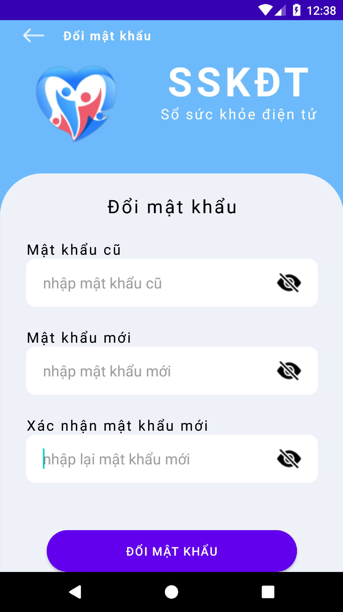
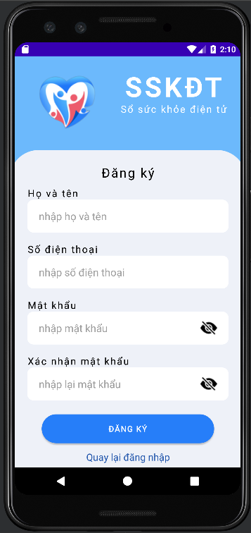
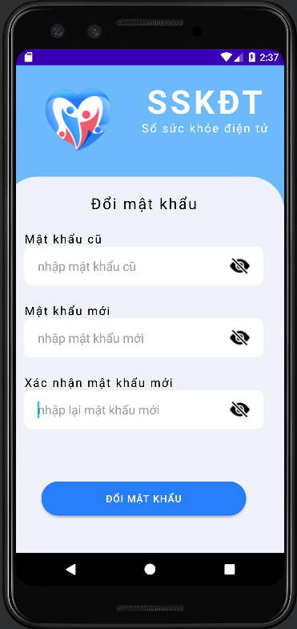

# Môn lập trình thiết bị di động - nhóm 5
<h3>Bài tập ứng dụng sổ sức khỏe điện tử</h3>
<h5><b>Link figma:</b>  <a href="https://www.figma.com/file/TxC1jl9mxBXi4UQTuzkYex/LTTBDD_Figma_SSK%C4%90T_app" target="_blank">https://www.figma.com/file/TxC1jl9mxBXi4UQTuzkYex/LTTBDD_Figma_SSK%C4%90T_app</a> </h5>
<h5><b>Mô tả:</b></h5>

- nhằm phục vụ việc đánh giá kết thúc môn học nhóm chúng e có làm 1 đề tài nhỏ với các chức năng căn bản. Ứng dụng được chúng em tham khảo dựa trên ứng dụng sổ sức khỏe điện tử, sau đó làm lại figma và code lại dựa trên giao diện của ứng dụng sẳn có. 

<h5><b>Các chức năng hiện có:</b></h5>
<ul type="square">
  <li> Ứng dụng cho phép người dùng đăng nhập, đăng ký</li>
  <li> chỉnh sửa thông tin cá nhân</li>
  <li> Đổi mật khẩu</li>
  <li> Khai báo tờ khai y tế</li>
  <li> Hiển thị danh sách các tờ khai y tế đã khai báo</li>
  <li> Hiển thị chi tiết các tờ khai đã khai</li>
  <li> chỉnh sửa tờ khai trong 24h</li>
  <li> Xóa các tờ khai không còn hiệu lực</li>
  </ul>
 <h5><b>Các giao diện đã hoàn thành:</b></h5>
 <ul type="none">
  <li>
      <h5>Giao diện đăng nhập</h5>
      
  </li>
  <li>
      <h5>Giao diện đăng ký</h5>
      
  </li>
  <li>
      <h5>Giao diện thay đổi mật khẩu</h5>
      
  </li>
 </ul>
