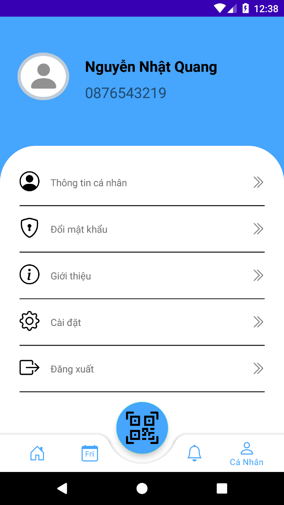

# Môn lập trình thiết bị di động - nhóm 5
### Bài tập ứng dụng sổ sức khỏe điện tử
<h5><b>Danh sách thành viên:</b></h5>
<table>
  <thead>
     <th>
        <td>Mã số sinh viên</td>
        <td>Họ và tên</td>
        <td>Đánh giá (A,B,C,D,F)</td>
        <td>Ghi chú</td>
    </th>
  </thead>
  <tbody>
      <tr>
        <td>1</td>
        <td>19528341</td>
        <td>Nguyễn Hải Nam</td>
        <td>A</td>
        <td></td>
      </tr>
      <tr>
        <td>2</td>
        <td>19530291</td>
        <td>Nguyễn Quý Khả</td>
        <td>A</td>
        <td></td>
      </tr>
      <tr>
        <td>3</td>
        <td>19437361</td>
        <td>Nguyễn Nhật Quang</td>
        <td>A</td>
        <td></td>
      </tr>
   </tbody>
 </table>

<h5><b>Bảng đánh giá:</b></h5>
<table>
  <thead>
     <th>
        <td>Mục tiêu</td>
        <td>Mức độ hoàn thành</td>
        <td>Ghi chú</td>
    </th>
  </thead>
  <tbody>
      <tr>
        <td>1</td>
        <td>Thiết kế giao diện bằng figma</td>
        <td>100%</td>
        <td>11 screen</td>
      </tr>
      <tr>
        <td>2</td>
        <td>Login - register bằng firebase</td>
        <td>100%</td>
        <td></td>
      </tr>
      <tr>
        <td>3</td>
        <td>FireStore Database CURD</td>
        <td>100%</td>
        <td></td>
      </tr>
      <tr>
        <td>4</td>
        <td>Storage (file - image)</td>
        <td>100%</td>
        <td></td>
      </tr>
      <tr>
        <td>5</td>
        <td>Đồng bộ dữ liệu SQLite vs firebase</td>
        <td>0%</td>
        <td>Team sử dụng toàn bộ bằng fireStore firebase</td>
      </tr>
      <tr>
        <td>6</td>
        <td>Sự dụng các công cụ như github, figma, trello</td>
        <td>75%</td>
        <td>Team chỉ sủ dụng figma và github</td>
      </tr>
  </tbody>
 </table>

<h5><b>Link figma:</b>  <a href="https://www.figma.com/file/TxC1jl9mxBXi4UQTuzkYex/LTTBDD_Figma_SSK%C4%90T_app" target="_blank">https://www.figma.com/file/TxC1jl9mxBXi4UQTuzkYex/LTTBDD_Figma_SSK%C4%90T_app</a> </h5>
<h5><b>Mô tả:</b></h5>

- nhằm phục vụ việc đánh giá kết thúc môn học nhóm chúng e có làm 1 đề tài nhỏ với các chức năng căn bản. Ứng dụng được chúng em tham khảo dựa trên ứng dụng sổ sức khỏe điện tử, sau đó làm lại figma và code lại dựa trên giao diện của ứng dụng sẳn có. 

<h5><b>Các chức năng hiện có:</b></h5>
<ul type="square">
  <li> Ứng dụng cho phép người dùng đăng nhập, đăng ký</li>
  <li> chỉnh sửa thông tin cá nhân</li>
  <li> Đổi mật khẩu</li>
  <li> Khai báo tờ khai y tế</li>
  <li> Hiển thị danh sách các tờ khai y tế đã khai báo</li>
  <li> Hiển thị chi tiết các tờ khai đã khai</li>
  <li> chỉnh sửa tờ khai trong 24h</li>
  <li> Xóa các tờ khai không còn hiệu lực</li>
  </ul>
 <h5><b>Các giao diện đã hoàn thành:</b></h5>
 <ul type="none">
  <li>
      <h5>Giao diện đăng nhập</h5>
      
  </li>
  <li>
      <h5>Giao diện đăng ký</h5>
      
  </li>
  <li>
      <h5>Giao diện thay đổi mật khẩu</h5>
      
  </li>
    <li>
      <h5>Giao diện xác thực</h5>
      
  </li>
   <li>
      <h5>Giao diện trang chủ</h5>
      
  </li>
   <li>
      <h5>Giao diện cá nhân </h5>
      
  </li>
   <li>
      <h5>Giao diện thông tin cá nhân</h5>
      
  </li>
   <li>
      <h5>Giao diện khai báo y tế</h5>
      
  </li>
   <li>
      <h5>Giao diện hoàn thành khai báo</h5>
      
  </li>
    <li>
      <h5>Giao diện danh sách thông tin khai báo</h5>
      
  </li>
 </ul>
